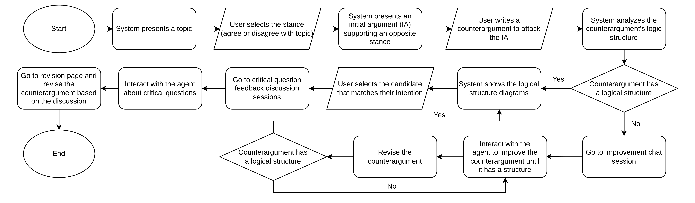

[](https://www.youtube.com/watch?v=YOUR_VIDEO_ID)
[Watch the demo](https://youtu.be/BCt04XOYVFU)

# Table of Contents

- [About This Repo](#about-this-repo)
- [Try out Here](#try-out-here)
    - [Notes](#notes)
- [CAT System](#cat-system)
    - [User Flow of the System](#user-flow-of-the-system)
- [How to Run the CAT System](#how-to-run-the-cat-system)
    - [Prerequisites](#prerequisites)
    - [Project Layout](#project-layout)
    - [Setup](#setup)
    - [Run The Server](#run-the-server)
    - [Data Export](#data-export)
    - [LLM Performance Evaluation](#llm-performance-evaluation)
    - [Deployment Notes](#deployment-notes)
- [Additional Material](#additional-material)

# About This Repo

This repository contains CAT (**C**ounter**A**rgument **T**utoring) system, a Django application designed for counter-argument writing practice and the collection of user study data. The main app presents initial arguments, collects user counter-arguments, identifies counter-argument structures with an LLM-backed predicate model, and guides users through feedback, revision, and completion flows.

The repository also contains a control-group app mounted under `/cggf/`, data loading commands for topics, initial arguments, and structure templates, plus export commands for collected results.

# Try out Here: 

**CAT:**
https://www.cl.ecei.tohoku.ac.jp/projects/calsa-webapp-premium-silkworm/

- Username: `demo`
- Password: `demodemo`

You can also try the control group system, ArgueTutor, modified to CA context from https://www.cl.ecei.tohoku.ac.jp/projects/calsa-webapp-premium-silkworm/cggf, with the same username and password above.

## Notes

- If you use Brave browser and cannot access the site, please try accessing the it from a private window or try another browser 

# CAT System

## User Flow of the System



# How to Run the CAT System 

## Prerequisites

- Python 3.12 or newer. The current environment has been used with Python 3.13.
- `uv` is recommended for running Django commands in this repo.
- SQLite is used by default.
- An OpenAI API key is required for LLM-backed structure detection and feedback.
<!-- - SMTP credentials are required only if password reset email should be sent through a real mail server. -->

## Project Layout

- `backend/manage.py`: Django management entry point.
- `backend/mysite/`: Django project settings, URL routing, auth helpers, and access control middleware.
- `backend/ca_practice/`: main CAT app.
- `backend/ca_practice_control_group_gpt_freestyle/`: control-group ArgueTutor app.
- `backend/llm_layer/local_predicate_model/`: prompt templates, predicate parser, static IA metadata, and performance scripts.
- `backend/ca_practice/data/`: seed data for topics, initial arguments, IA points, and structure/CQ templates.

## Setup

Run setup commands from the `backend/` directory unless noted otherwise.

1. Install dependencies.

   ```bash
   uv pip install -r ../requirements.txt
   ```

   If your environment does not use `uv`, install with `pip` instead:

   ```bash
   pip install -r ../requirements.txt
   ```

2. Create the Django environment file.

   ```bash
   cd backend
   cp .env.example .env
   ```

3. Edit `backend/.env`.

   Minimum local development values:

   ```bash
   DJANGO_SECRET_KEY=change-me-to-a-long-random-string
   DJANGO_DEBUG=true
   DJANGO_ALLOWED_HOSTS=localhost,127.0.0.1
   APP_BASE_PATH=/projects/calsa-webapp
   CA_PRACTICE_MAIN_APP_GROUP=ca_main_users
   CA_PRACTICE_CG_APP_GROUP=ca_cggf_users
   ```

   For production, keep `DJANGO_DEBUG=false`, configure `DJANGO_ALLOWED_HOSTS`, set `DJANGO_CSRF_TRUSTED_ORIGINS`, and use a strong secret key.

4. Configure OpenAI access.

   The LLM code expects `OPENAI_API_KEY` in the environment. You can export it in your shell or place it in the repo-level `local.env` file:

   ```bash
   OPENAI_API_KEY=your_api_key_here
   ```

   The local predicate model config is:

   ```text
   backend/llm_layer/local_predicate_model/openai_config.yaml
   ```

   It currently uses `gpt-5.2`.

5. Initialize the database.

   By default, Django uses:

   ```text
   backend/db.sqlite3
   ```

   To temporarily use another SQLite database, set this in `backend/.env`:

   ```bash
   DJANGO_SQLITE_PATH=/absolute/path/to/temp-db.sqlite3
   ```

   Then run migrations against the selected database:

   ```bash
   uv run manage.py migrate
   ```

   Users, superusers, groups, sessions, and study data live in the selected database file. If you switch to a temporary DB, create the needed superuser/groups there too. To return to the original data, unset `DJANGO_SQLITE_PATH` or point it back to `backend/db.sqlite3`, then restart the server.

6. Create an admin user.

   ```bash
   uv run manage.py createsuperuser
   ```

7. Load seed data.

   ```bash
   uv run manage.py load_topics_ias ca_practice/data/topics_ias_both_sides.csv --points-csv ca_practice/data/ia_points.csv
   uv run manage.py load_structures_cqs ca_practice/data/structures_cqs.json --clear
   uv run manage.py load_topics_ias_cggf ca_practice/data/topics_ias_both_sides.csv
   ```

8. Set up access groups.

   The login redirect and access middleware use these groups by default:

   - `ca_main_users`
   - `ca_cggf_users`

   Create them in Django admin and assign users to the appropriate group, or configure the group names with:

   ```bash
   CA_PRACTICE_MAIN_APP_GROUP=ca_main_users
   CA_PRACTICE_CG_APP_GROUP=ca_cggf_users
   ```

   For simple username allowlists instead, use:

   ```bash
   CA_PRACTICE_MAIN_APP_ALLOWED_USERS=user1,user2
   CA_PRACTICE_CG_APP_ALLOWED_USERS=user3,user4
   ```

## Run The Server

From `backend/`:

```bash
uv run manage.py runserver 8888
```

Open:

```text
http://localhost:8888/projects/calsa-webapp/
```

Useful local URLs:

- Admin: `http://localhost:8888/projects/calsa-webapp/admin/`
- Main app: `http://localhost:8888/projects/calsa-webapp/`
- Control group: `http://localhost:8888/projects/calsa-webapp/cggf/`
- Login status: `http://localhost:8888/projects/calsa-webapp/accounts/auth-status/`
- Password reset by username: `http://localhost:8888/projects/calsa-webapp/accounts/password-reset-by-username/`

## Data Export

From `backend/`:

```bash
uv run manage.py export_all_csv_main --out-dir exports/ca_practice
uv run manage.py export_all_csv_cg --out-dir exports/ca_practice_control_group_gpt_freestyle
```

## LLM Performance Evaluation

The CALSA+ performance script is located at:

```text
backend/llm_layer/local_predicate_model/test_performance/run_calsaplus_performance.py
```

Run a small smoke test:

```bash
python llm_layer/local_predicate_model/test_performance/run_calsaplus_performance.py --limit 3
```

Run the full dataset:

```bash
python llm_layer/local_predicate_model/test_performance/run_calsaplus_performance.py
```

The script writes predictions, per-instance prompts/results, grouped predicate questions, and slot-filler metrics under:

```text
backend/llm_layer/local_predicate_model/test_performance/
```

Slot-filler evaluation requires BERTScore:

```bash
uv pip install bert-score
```

## Deployment Notes

The app is mounted under `APP_BASE_PATH`, which defaults to:

```text
/projects/calsa-webapp
```

Cookies are scoped to this base path in `backend/mysite/settings.py` so that parallel deployments on the same domain do not overwrite each other. In production, configure:

- `DJANGO_SECRET_KEY`
- `DJANGO_DEBUG=false`
- `DJANGO_ALLOWED_HOSTS`
- `DJANGO_CSRF_TRUSTED_ORIGINS`
- `APP_BASE_PATH`
- access groups or username allowlists
<!-- - email settings if password reset should send mail -->

# Additional Material
